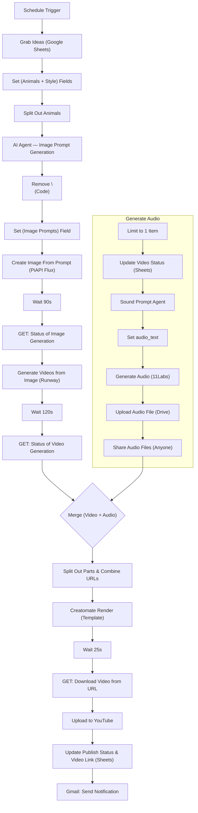

# Faceless Short System — Automated Short Video Production for Marketing & Ads

[](#) [](#) [](#) [](#) [](#) [](#) [](#)

---

## Project Overview

* Faceless Short System automates production of vertical short videos (1080×1920) from idea → prompts → images → videos → audio → templated render → upload & notify.
* Built for marketing, advertising, and creative teams that require high-volume, consistent, brand-safe short-form content with minimal manual editing.
* Uses agent-driven prompt generation, Flux (PiAPI) for image generation, Runway for image→video conversion, 11 Labs for audio, and Creatomate for templated rendering; Google Sheets and Drive provide tracking and asset storage.
* Designed to reduce turnaround time, increase content throughput, and maintain consistent branding and compliance across batches.

---

**Workflow Diagram**


---


## Pain Points Solved

* Slow, inconsistent manual asset creation across images, audio, and video.
* Time-consuming repetitive editing and templating tasks requiring specialized skill.
* High coordination overhead between creators, audio engineers, and publishers.
* Hard to scale short-form production while ensuring brand safety and consistency.

---

## How This Helps (client-focused)

* End-to-end automation reduces manual steps from ideation to publish-ready short.
* Template-driven rendering (Creatomate) enforces consistent branding and layout.
* AI agents create diverse, high-quality prompts while preserving brand tone.
* Centralized tracking (Google Sheets) and automated notifications (Gmail) simplify approvals.
* Increased throughput with the same team headcount and lower per-asset cost.

---

## Estimated Productivity Gains

> Estimates vary by organization and content complexity.

* Time-to-publish per short reduced by **~70–90%** (often under 30 minutes).
* Content throughput increased **3×–6×** with the same team.
* Manual editing & coordination hours saved **60–80%** per campaign.
* Cost per asset reduced **40–60%** via automation and templating.

---

## Mermaid Flow Overview (high-level)



---

## Node-by-Node Configuration


### 1. **Schedule Trigger**

* *Purpose:* Start workflow on schedule or manual run.
* **Inputs / Params:** Trigger every 3 days @ 16:15 (4:15 PM).

---

### 2. **Grab Ideas (Google Sheets)**

* *Purpose:* Fetch first sheet row with `Video Status = To Do`.
* **Inputs:** Google Sheets doc: `26. Youtube Shorts Content Creation Image 2 video`, Sheet: `Sheet1`.
* **Operation:** `Get Row(s)` → Return only first matching row.
* **Credential:** Google Sheets AIS.

---

### 3. **Set (Animals + Style) Fields (Edit Field)**

* *Purpose:* Consolidate animals into array and capture style string.
* **Inputs:** `Animal 1`..`Animal 4`, `Style` from sheet row.
* **Fields set:**

  * `animals = ["{{ $json['Animal 1'] }}","{{ $json['Animal 2'] }}","{{ $json['Animal 3'] }}","{{ $json['Animal 4'] }}"]`
  * `style = {{ $json.Style }}`

---

### 4. **Split Out Animals**

* *Purpose:* Convert `animals` array into individual items (one per animal).
* **Inputs:** `animals` array.
* **Options:** Include no other fields.

---

### 5. **Image Prompt Generation (AI Agent — Tool Agent)**

* *Purpose:* Generate a single-line, high-fidelity image prompt per animal + style.
* **Inputs (User Message):**

  ```
  Animal :{{ $json.animals }}

  Style: {{ $('Set (Animals + Style) Fileds').item.json.style }}
  ```
* **System Message :**

  ```
  Agent: Tool Agent

  # Overview
  You are a master image prompt generator specialized in crafting detailed, high-quality prompts for advanced image models like Flux. Your task is to generate vivid, well-structured prompts that accurately depict an animal dressed in a specified style, with a matching background that complements the theme.

  ## Instructions:
  - Clearly describe the animal's appearance, including fur, feathers, or scales.
  - Specify the outfit and accessories that reflect the given style, ensuring they fit naturally.
  - Include details about the background that reinforce the style, creating a cohesive scene.
  - Use rich, descriptive language to enhance visual fidelity.
  - Avoid generic terms—opt for precise, imaginative descriptions that maximize prompt effectiveness.
  - Never output quotation marks ("") or newlines (\n)

  ## Example 

  Agent: Tool Agent # Overview You are a master image prompt generator specialized in crafting detailed, high-quality prompts for advanced image models like Flux. Your task is to generate vivid, well-structured prompts that accurately depict an animal dressed in a specified style, with a matching background that complements the theme. ## Instructions: - Clearly describe the animal's appearance, including fur, feathers, or scales. - Specify the outfit and accessories that reflect the given style, ensuring they fit naturally. - Include details about the background that reinforce the style, creating a cohesive scene. - Use rich, descriptive language to enhance visual fidelity. - Avoid generic terms—opt for precise, imaginative descriptions that maximize prompt effectiveness. - Never output quotation marks ("") or newlines (\n) ## Example  - Input: Animal: Fox Style: Cyberpunk - Output: A sleek red fox with vibrant fur and piercing blue cybernetic eyes, wearing a futuristic black leather jacket with neon blue accents and glowing circuitry patterns. A high-tech visor covers one eye, displaying holographic data. The fox stands confidently on a rain-slicked city street illuminated by neon signs in Japanese and English. Hovering drones and bustling pedestrians in cybernetic attire add depth to the scene, while distant flying cars streak through the dark, misty skyline. ## IMPORTANT - All prompts must be family friendly, no sensitive words should be used. - No references to weapons (even toy guns). - No reference of “showdowns" or violent events.
  ```
* **Model / Credential:** OpenAI GPT-4o (`gpt-4o`) configured in workflow.
* **Output:** `output` (single-line prompt string).

---

### 6. **Remove \n (Code Node)**

* *Purpose:* Strip newline characters and escaped newlines from agent output.
* **Mode:** Run Once for All Items (JavaScript).
* **Script :**

```js
// N8N Code Node to remove all newline characters from previous node outputs

// Process all items in the array
// This will work regardless of whether we're running once for all items or once per item
for (let i = 0; i < items.length; i++) {
  const currentItem = items[i];
  
  // Check if the item has an output property
  if (currentItem.json && currentItem.json.output !== undefined) {
    // Replace all newline characters with empty string
    // Using a global regex to catch ALL instances of \n
    currentItem.json.output = currentItem.json.output.replace(/\\n/g, '');
    
    // Also replace actual newline characters if they exist
    currentItem.json.output = currentItem.json.output.replace(/\n/g, '');
  }
}

// Return the processed items array
return items;
```

---

### 7. **Set (Image Prompts) Field (Edit Field)**

* *Purpose:* Save cleaned prompt to `image_prompts` field for downstream image generation.
* **Inputs:** `{{ $json.output }}` → saved as `image_prompts`.

---

### 8. **Create Image From Prompt : PiAPI (HTTP POST)**

* *Purpose:* Generate images using Flux model via PiAPI.
* **Method / URL:** POST `https://api.piapi.ai/api/v1/task`
* **Body (JSON):**

```json
{
  "model": "Qubico/flux1-dev",
  "task_type": "txt2img",
  "input": {
    "prompt": "{{ $json.image_prompts }}",
    "width": 540,
    "height": 960
  }
}
```

* **Auth:** Header Auth (Pi API Flux)
* **Output:** `data.task_id`, `data.output.image_url`

---

### 9. **Wait (90 seconds)**

* *Purpose:* Allow PiAPI time to generate image.

---

### 10. **GET: Status of Image Generation (PiAPI)**

* *Purpose:* Poll PiAPI for image generation status.
* **Method / URL:** GET `https://api.piapi.ai/api/v1/task/{{ $json.data.task_id }}`
* **Auth:** Pi API Flux header credential
* **Output:** `data.output.image_url`

---

### 11. **Generate Videos from Image (Runway — HTTP POST)**

* *Purpose:* Convert generated image(s) into 5s short video(s) via Runway.
* **Method / URL:** POST `https://api.dev.runwayml.com/v1/image_to_video`
* **Headers:** `X-Runway-Version: 2024-11-06` + Runway header auth
* **Body (JSON):**

```json
{
  "promptImage": "{{ $json.data.output.image_url }}",
  "model": "gen3a_turbo",
  "promptText": "{{ $json.data.input.prompt }}",
  "duration": 5,
  "ratio": "768:1280"
}
```

* **Output:** `id` (task id) for polling.

---

### 12. **Wait (120 seconds)**

* *Purpose:* Allow Runway to process video generation.

---

### 13. **GET: Status of Video Generation (Runway)**

* *Purpose:* Poll Runway for generated video URLs.
* **Method / URL:** GET `https://api.dev.runwayml.com/v1/tasks/{{ $json.id }}`
* **Headers:** `X-Runway-Version: 2024-11-06`
* **Output:** Generated video URLs (array)

---

## Flow Split — two parallel flows (after Step 13)

* **Flow A — Generate Audio** (Steps 14.A → 14.G)
* **Flow B — Render & Upload (Video + Audio)** (Steps 14.1 → 14.8)

---

## Flow A — Generate Audio (detailed)

#### 14.A **Limit (Limit to 1 item)**

* *Purpose:* Process single item for audio generation.
* **Params:** Max Items = 1 (keep first).

#### 14.B **Update Video Status (Google Sheets)**

* *Purpose:* Set `Video Status = Created` on source row.
* **Inputs:** `row_number = {{ $('Grab Ideas').item.json.row_number }}`

#### 14.C **Sound Prompt Agent (AI Agent)**

* *Purpose:* Produce a vivid one-to-two sentence sound prompt describing ambiance and key audio elements based on `Style`.

* **Inputs (User Message):** `Style: {{ $('Grab Ideas').item.json.Style }}`

* **System Message :**

  ```
  # Overview
  You are a master sound prompt generator. Given a style, generate a vivid one-to-two sentence prompt that describes the ambiance, tone, and key sound elements to create an immersive audio scene. Use evocative language to capture the essence of the style.

  ## Example
  - Style: Haunted Ghost Hunters
  - Output: Eerie whispers echo through a decaying mansion as floorboards creak under cautious footsteps. A distant, distorted radio crackles with ghostly voices, while a cold wind howls through shattered windows.

  # Overview You are a master sound prompt generator. Given a style, generate a vivid one-to-two sentence prompt that describes the ambiance, tone, and key sound elements to create an immersive audio scene. Use evocative language to capture the essence of the style. ## Example - Style: Haunted Ghost Hunters - Output: Eerie whispers echo through a decaying mansion as floorboards creak under cautious footsteps. A distant, distorted radio crackles with ghostly voices, while a cold wind howls through shattered windows.
  ```

* **Model / Credential:** `gemini-2.5-flash` as configured in workflow preview.

* **Output:** `output` (sound prompt string).

#### 14.D **Set: audio_text (Edit Field)**

* *Purpose:* Save trimmed audio text for 11 Labs.
* **Inputs:** `audio_text = {{ $json.output.trimEnd() }}`

#### 14.E **Generate Audio (11 Labs — HTTP POST)**

* *Purpose:* Produce the audio file.
* **Method / URL:** POST `https://api.elevenlabs.io/v1/sound-generation`
* **Headers:** `xi-api-key: <XI_API_KEY>` (use n8n credentials in production)
* **Body params:** `text = {{ $json.audio_text }}`, `duration_seconds = 20`
* **Output:** Binary audio / file id

#### 14.F **Upload Audio file (Google Drive)**

* *Purpose:* Upload generated audio to `Audio Files` folder.
* **File Name:** `{{ $('Grab Ideas').item.json.Style }}`
* **Credential:** Google Drive account AIS

#### 14.G **Share Audio Files to Anyone (Google Drive)**

* *Purpose:* Make audio publicly accessible (Reader, Anyone) and produce `webContentLink`.
* **Inputs:** `file = {{ $json.id }}`

---

## Flow B — Render & Upload (Video + Audio)

#### 14.1 **Merge (Video + Audio) data**

* *Purpose:* Combine video URLs and audio links into all possible combinations.
* **Mode:** Combine — All Possible Combinations

#### 14.2 **Code Node — Split Out Parts & combine**

* *Purpose:* Extract URLs from outputs and combine into a single `urls` array for templating.
* **Mode:** Run Once for All Items (JavaScript)
* **Core behavior:** Return `[{ json: { urls: [ { url, sourceId, createdAt }, ... ] } }]`

*(JavaScript code included in project assets; keeps `urlArray` with metadata)*

#### 14.3 **Creatomate: Video & Audio editor (Template Code)**

* *Purpose:* Render final MP4 by injecting 4 video sources + audio + dynamic text into Creatomate template.
* **Method / URL:** POST `https://api.creatomate.com/v2/renders`
* **Header:** `Authorization: Bearer <CREATOMATE_API_KEY>`
* **Body (sample modifications):**

```json
{
  "template_id": "17948600-6100-4155-9227-______________",
  "modifications": {
    "Video-1.source": "{{ $json.urls[0].url }}",
    "Video-2.source": "{{ $json.urls[1].url }}",
    "Video-3.source": "{{ $json.urls[2].url }}",
    "Video-4.source": "{{ $json.urls[3].url }}",
    "Audio-Track.source": "{{ $('Upload Audio file').first().json.webContentLink }}",
    "Text-1.text": "{{ $('Grab Ideas').first().json['Animal 1'] }}",
    "Text-2.text": "{{ $('Grab Ideas').first().json['Animal 2'] }}",
    "Text-3.text": "{{ $('Grab Ideas').first().json['Animal 3'] }}",
    "Text-4.text": "{{ $('Grab Ideas').first().json['Animal 4'] }}"
  }
}
```

* **Template details:** 1080×1920, 4×5s video segments, 20s audio track, 4 dynamic text elements (full template JSON in project assets).

#### 14.4 **Wait (25 seconds)**

* *Purpose:* Allow Creatomate to prepare downloadable render.

#### 14.5 **GET: Download Video from URL**

* *Purpose:* Download final MP4 from `{{ $json.url }}`.

#### 14.6 **YouTube Upload**

* *Purpose:* Upload final short to YouTube channel.
* **Title:** `{{ $('Grab Ideas').first().json.Title }}`
* **Description:** `{{ $('Grab Ideas').first().json.Caption }}`
* **Region Code:** IN — **Category ID:** 15

#### 14.7 **Update (Publish status & Video Link) — Google Sheets**

* *Purpose:* Update original row: `Publish Status = Processed`, `Video Link = {{ $('GET : Download Video from URL').item.json.url }}`
* **Inputs:** `row_number = {{ $('Grab Ideas').first().json.row_number }}`

#### 14.8 **Gmail: Send a message**

* *Purpose:* Notify owner (Sachin) that new short has been processed and awaits approval.
* **To:** `sachinsavkare08@gmail.com`
* **Subject:** `New Short Processed: {{ $('Grab Ideas').first().json.Title }}`
* **Body:** Short notification with link to Studio / video.

---

## Free Workflow Template

* **Download:** [n8n workflow JSON](https://github.com/SachinSavkare/Faceless-Shorts-System-n8n/blob/main/26.%20Faceless%20Shorts%20System.json)

---

## Operational Notes & Recommendations

* **Costs:** Flux image ≈ $0.015 / image (Qubico/flux1-dev). Runway ≈ 25 credits per 5s video. Monitor usage and budget.
* **Security:** Replace inline API keys with n8n credential store / environment variables — do not hardcode secrets.
* **Reliability:** Add retries and exponential backoff for HTTP nodes; add alerts for failed renders or empty outputs.
* **Human-in-the-loop:** Google Sheets + Gmail notifications provide review/approval touchpoints. Consider an approval step if brand compliance requires manual checks.
* **Template Management:** Maintain and version Creatomate templates for brand updates and seasonal changes.

---

## Author

**Sachin Savkare**
[sachinsavkare08@gmail.com](mailto:sachinsavkare08@gmail.com)
